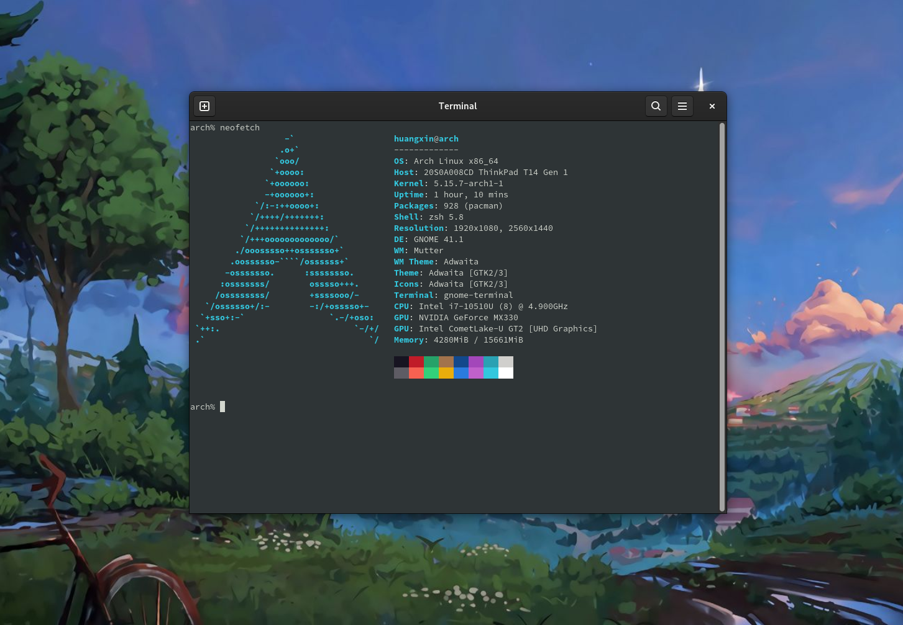

# MyAchConfig
记录打造最适合自己的Arch &amp; Gnome开发环境过程

## 安装系列

### 1. Install arch with GUI

选择Gnome桌面环境的最简安装，进入网页选Gnome Editions -> Gnome Pure Edition
```shell
https://archlinuxgui.in/
```

GUI傻瓜式安装完成后，输入下列指令 wow amzing

```shell
$ sudo pacman -S neofetch
$ neofetch
```




---


## 踩坑系列

### 1. 声卡的配置 

```shell
# 终端输入alsamixer在F6找不到声卡
3$ alsamixer

# 安装sof-firmware驱动，然后再次进入alsamixer选择声卡 defualt：0 sof-hda-dsp 
# 按M打开headphone声音，just enjoy music
$ sudo pacman - S sof-firmware
```


### 2. weixin.deepin安装后中文字体显示为方框

```shell
# 安装weixin.deepin
$ pacman -S deep-wine-wechat

# 显示方框是因为缺少中文字体
$ sudo pacman -S wqy-microhei
```


