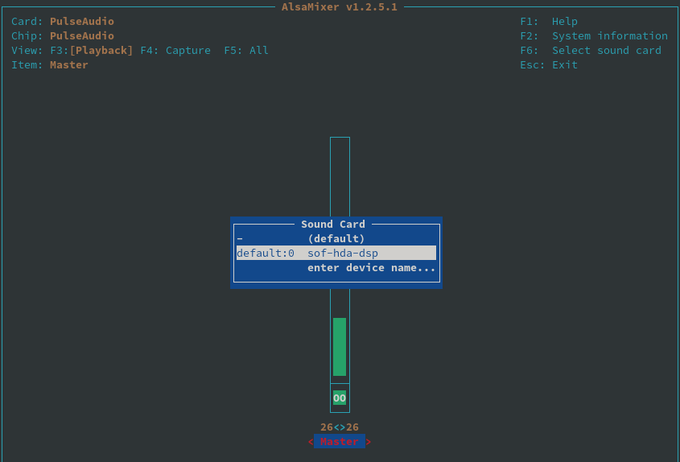

# MyAchConfig
记录打造最适合自己的Arch &amp; Gnome开发环境过程

## 安装系列

### 1. Install arch with GUI

选择Gnome桌面环境的最简安装，进入网页选Gnome Editions -> Gnome Pure Edition
```
https://archlinuxgui.in/
```


## 踩坑系列

### 1. 声卡的配置 

```shell
# 终端输入alsamixer在F6找不到声卡
$ alsamixer

# 安装sof-firmware驱动，然后再次进入alsamixer选择声卡 defualt：0 sof-hda-dsp 
# 按M打开headphone声音，just enjoy music ~ 
$ sudo pacman - S sof-firmware
```


